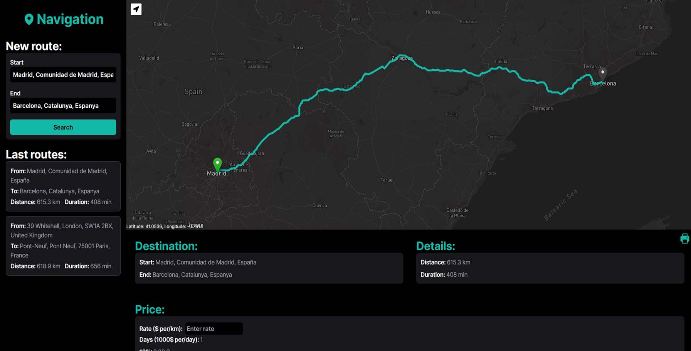

# Navigation App



Web navigation app that allows users to input a desired route and instantly view it on the map, complete with estimated distance and time of travel.

https://navigation-sd.vercel.app/map

## Main technologies


## Stack

- [Heroicons](https://heroicons.com/) - beautiful hand-crafted SVG icons, by the makers of Tailwind CSS
- [Leaflet](https://leafletjs.com) - an open-source JavaScript library for mobile-friendly interactive maps
- [Leaflet Locate Control](https://github.com/domoritz/leaflet-locatecontrol) - useful control to geolocate the user with many options. Official Leaflet and MapBox plugin
- [Leaflet Routing Machine](https://www.liedman.net/leaflet-routing-machine) - an easy, flexible and extensible way to add routing to a Leaflet map
- [React Leaflet](https://react-leaflet.js.org) - React components for Leaflet maps
- [React Router](https://reactrouter.com/en/main) - a standard library for routing in React
- [ReactToPrint](https://github.com/gregnb/react-to-print) - library with ability to print React components in the browser
- [Vite](https://vitejs.dev) - a new breed of frontend build tooling that significantly improves the frontend development experience
- [vite-plugin-rewrite-all](https://github.com/ivesia/vite-plugin-rewrite-all) - plugin that fix dev server not rewriting the path includes a dot vite#2190

## Details

- created with React (Vite) and TypeScript
- context and reducer for managing global state
- locating your current location
- map tiles provided by Mapbox
- finding addresses and coordinates with the Here API
- create routes with the accuracy of the house number
- create routes by dragging markers on the map
- loading a route from a URL search params
- loading recently saved routes
- calculation of travel costs
- printing route details with ReactToPrint
- routing with React Router
- unit testing with Jest
- responsive website design
- styling with Tailwind CSS

## Tutorial and project structure

Inside the project you'll see the following folders and files:

```
PROJECT_ROOT
├── public              # static assets
└── src
    ├── assets          # images
    ├── components      # React components
    ├── lib
    │   ├── api         # API functions
    │   ├── context     # React context and reducer files
    │   ├── helpers     # helpful functions
    │   ├── interfaces  # TypeScript interfaces
    │   └── test        # Jest test functions
    ├── pages           # page files
    └── styles          # style files
```

Download the repository to your local machine and run to download all missing dependencies:

```
yarn install
```

After that you can run this project with:

```
yarn dev
```

To build your application use:

```
yarn build
```

**The application requires a connection to Here API. To do this, you need to create an account on https://platform.here.com, create a new project, add _Autocomplete, Forward Geocoder, Reverse Geocoder_ services and generate a token that will enable communication with the API.**

**In addition to this, you will need a link to a Leaflet-supported map tiles (e.g. Mapbox).**

After these operations, create a `.env.local` file with the following data in the main folder and restart your application:

```
VITE_HERE_API_KEY = YOUR_HERE_API_TOKEN
VITE_MAP_TILES = YOUR_MAP_TILES_LINK
```
